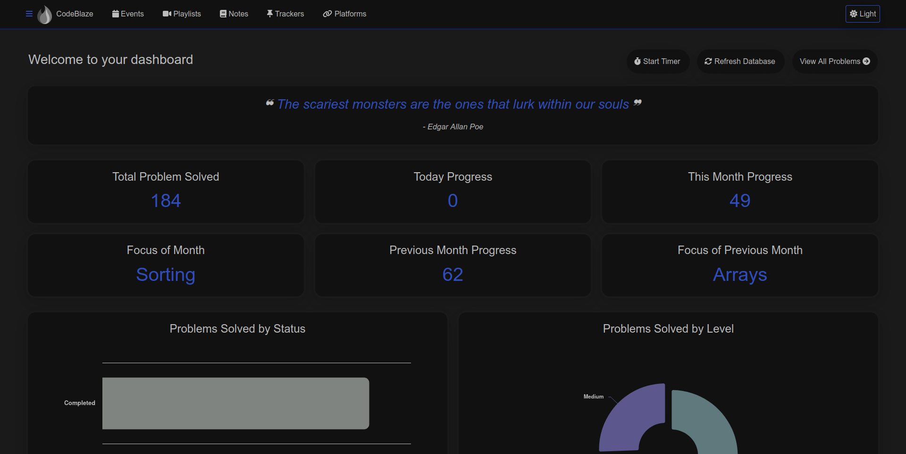
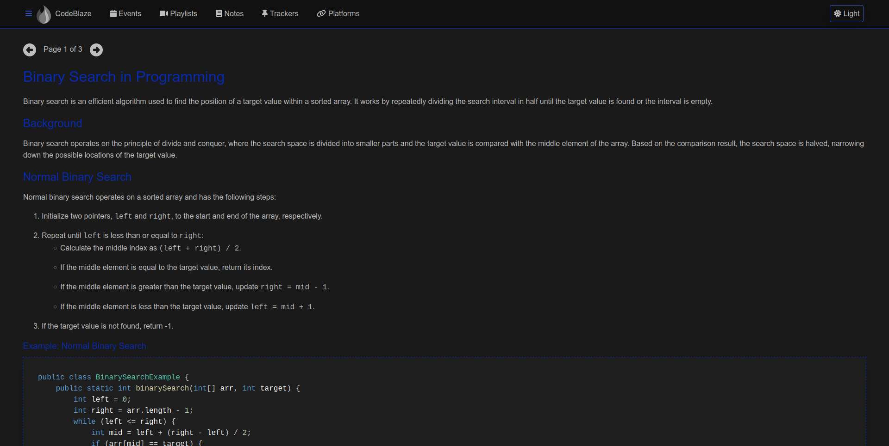
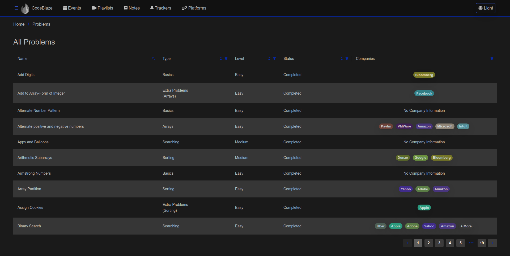
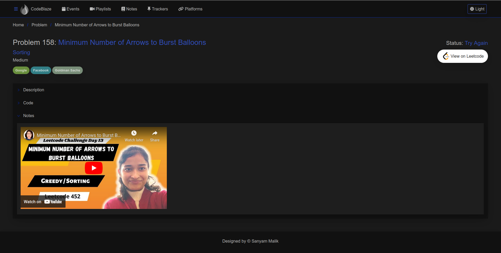

# CodebaseNG

Welcome to CodebaseNG! This Angular project is designed to track your dsa progress.

## Table of Contents

- [Installation](#installation)
- [Usage](#usage)
- [Features](#features)
- [Contributing](#contributing)
- [License](#license)
- [Screenshots](#screenshots)

## Installation

To get started with CodebaseNG, follow these steps:

1. Clone this repository to your local machine using `git clone https://github.com/yourusername/codebase-ng.git`
2. Navigate into the project directory: `cd codebase-ng`
3. Install dependencies using npm: `npm install --force`

## Usage

Once you've installed the dependencies, you can start the development server using Angular CLI:

```bash
ng serve --open
```
## Features
1. DSA Progress Tracking
2. Real Time-Analytics Based on Metadata
3. Reminders (Coming Soon)
4. Trackers (Coming Soon)
5. Playlist (Coming Soon)

## Contributing

If you'd like to contribute to Codebase, feel free to submit a pull request. Please follow these guidelines:

    Fork the repository
    Create a new branch (git checkout -b feature/your-feature)
    Make your changes
    Commit your changes (git commit -am 'Add some feature')
    Push to the branch (git push origin feature/your-feature)
    Create a new Pull Request

## License

This project is licensed under the MIT License.

## Screenshots

### Dashboard


### Notes


### All Problems


### Problem-View
